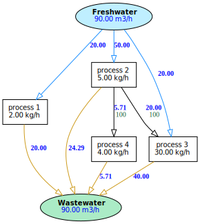

"""""""""""""""""
Water Pinch Analysis
"""""""""""""""""
A powerful pure-Python interface for optimizing industrial water networks

.. contents:: Overview
   :depth: 3

Installation
"""""""""""""""""

``WaterOptim``  runs under Python 3.6+. To install it with `pip`_, run the following:

.. _pip: https://pypi.org/project/WaterOptim/

.. code:: python

  pip install WaterOptim

To upgrade it with `pip`_, run the following:

.. _pip: https://pypi.org/project/WaterOptim/

.. code:: python

  pip install --upgrade WaterOptim

Basic Usage
"""""""""""""""""

``WaterOptim`` proposes water networks with optimized water recovery schemes to preserve freshwater and minimize wastewater production. The tool supports water networks with one or more pollutants.

The optimization strategy includes 3 steps:

- Inventory
- Minimization of Freshwater and Wastewater
- Design of Water-network

The inventory can be carried out on:

- ``Water-using process``
- ``Sources``
- ``Sinks``

``Water-using process`` involves pollution transfer. The pollution comes from the product or the process.

The inventory includes:

.. code-block::

  +----------+------------------------------+------+
  |          |          Parameter           | Unit |
  +----------+------------------------------+------+
  |    mc    | Mass flowrate of contaminant | kg/h |
  | cin_max  | Maximum inlet concentration  | ppm  |
  | cout_max | Maximum outlet concentration | ppm  |
  +----------+------------------------------+------+
      
      
Example of ``Water-using process`` inventory:

.. code:: python

  posts = [
            {"name":"process 1","cin_max":0,"cout_max":100,"mc":2},
            {"name":"process 2","cin_max":50,"cout_max":100,"mc":5},
            {"name":"process 3","cin_max":50,"cout_max":800,"mc":30},
            {"name":"process 4","cin_max":400,"cout_max":800,"mc":4}
          ]
          
``Source`` water flow, available for the ``REUSE``.

The inventory includes:
 
.. code-block::

  +---+----------------------+------+
  |   |      Parameter       | Unit |
  +---+----------------------+------+
  | m |    Water flowrate    | m3/h |
  | c | Outlet concentration | ppm  |
  +---+----------------------+------+

Example of ``Sources`` inventory:

.. code:: python

  sources = [
              {'name':'Distillation bottoms','c':0,'m':.8*3600/1000},
              {'name':'Off-gas condensate','c':14,'m':5*3600/1000},
              {'name':'Aqueous layer','c':25,'m':5.9*3600/1000},
              {'name':'Ejector condensate','c':34,'m':1.4*3600/1000}]

``Sink`` water requirement.
 
The inventory includes:

.. code-block::

  +---------+-----------------------------+------+
  |         |          Parameter          | Unit |
  +---------+-----------------------------+------+
  |    m    |        Water flowrate       | m3/h |
  | cin_max | Maximum inlet concentration | ppm  |
  +---------+-----------------------------+------+
  
Example of ``Sinks`` inventory:

.. code:: python

  demands = [
              {'name':'BFW0','cin_max':0,'m':1.2*3600/1000},
              {'name':'BFW','cin_max':10,'m':5.8*3600/1000},
              {'name':'BFW1','cin_max':1,'m':19.8*3600/1000}]
              
              
              
Basic compilation
"""""""""""""""""

Import this module with the following command:

.. code:: python

  import WaterOptim.wpinch as wp

Compilation of ``water-using processes``

.. code:: python

  r= wp.__pinch__(posts=posts,verbose=True,design=True)  

Using the ``cascade`` attribute you can access the optimization details:

.. code:: python

   >> r.cascade

    +---------+------------+-------------------+----------+----------+-----------+--------+--------+
    |  C ppm  |   Purity   | Purity Difference |   NWSD   |   CWSD   |    PWF    |  CPWF  |  FFW   |
    +---------+------------+-------------------+----------+----------+-----------+--------+--------+
    |    -    |     -      |         -         |    -     | fw=90.00 |           |        |        |
    |    0    |  1.000000  |                   |  -20.00  |          |           |        |        |
    |         |            |      0.000050     |          |  70.00   |  0.003500 |        |        |
    |    50   |  0.999950  |                   | -140.00  |          |           |  0.00  | 70.00  |
    |         |            |      0.000050     |          |  -70.00  | -0.003500 |        |        |
    |  {100}  | {0.999900} |         {}        | {120.00} |    {}    |     {}    | {0.00} | {0.00} |
    |         |            |      0.000300     |          |  50.00   |  0.015000 |        |        |
    |   400   |  0.999600  |                   |  -10.00  |          |           |  0.01  | 37.50  |
    |         |            |      0.000400     |          |  40.00   |  0.016000 |        |        |
    |   800   |  0.999200  |                   |  50.00   |          |           |  0.03  | 38.75  |
    |         |            |      0.999200     |          |  90.00   | 89.928000 |        |        |
    | 1000000 |  0.000000  |                   |   0.00   |          |           | 89.96  | 89.96  |
    |    -    |     -      |         -         |    -     | ww=90.00 |           |        |        |
    +---------+------------+-------------------+----------+----------+-----------+--------+--------+

To display the water network:

.. code:: python

   >> r.design.draw()

Dependencies
"""""""""""""""""

 - `scipy`_ 
 - `numpy`_
 - `matplotlib`_
 - `graphviz`_
 
 .. _scipy : https://www.scipy.org/
 .. _numpy : https://numpy.org/
 .. _matplotlib : https://matplotlib.org/
 .. _graphviz : https://graphviz.org/

Acknowledgments
"""""""""""""""""
The authors wish to thank the French National Research Agency `ANR`_ for their funding, and the partners of the project `MINIMEAU`_ led by **AgroParisTech** (French higher education and public research institute), in collaboration with **ProSim** (Expert in process simulation) **ACTALIA**, **CRITT**, **CTCPA**, **IFV**, **ITERG** (Centers of expertise for the food industry), and **INRAE ELSA** (French institute for agriculture, food and environment)

  .. _ANR : https://anr.fr/Projet-ANR-17-CE10-0015
  .. _MINIMEAU: https://minimeau.fr/
  
