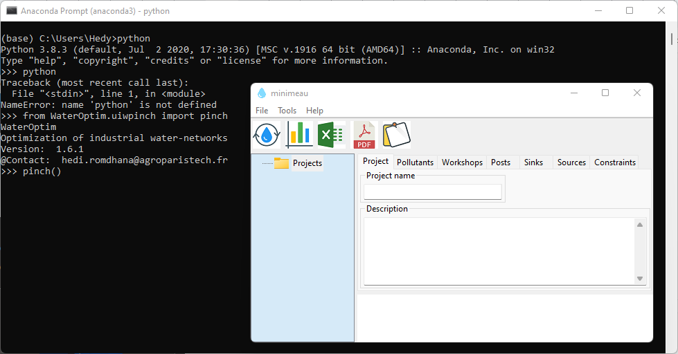
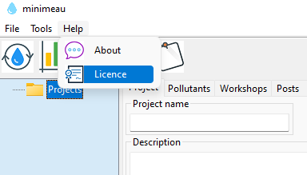

========================
Graphical User Interface
========================

To launch the interface, you must first install the anaconda tool. The following link directs you to the official `anaconda`_

---------------------------------
Installing ``WaterOptim`` Package
---------------------------------

- From Windows taskbar enter ``anaconda``, then click on ``Anaconda Prompt``
- Enter the instruction ``pip install WaterOptim`` then ``enter key``

-----------------------------
Update ``WaterOptim`` Package
-----------------------------

- From Windows taskbar enter ``anaconda``, then click on ``Anaconda Prompt``

- Enter the instruction ``pip install WaterOptim --upgrade`` then ``enter key``

----------------------------
Launching the user interface
----------------------------
- From Windows taskbar enter ``anaconda``, then click on ``Anaconda Prompt``
- Launch Python with the instruction ``python`` then ``enter key``
- Import ``WaterOptim`` package with the instruction ``from WaterOptim.uiwpinch import pinch`` then ``enter key``
- Launch the interface with ``pinch()`` instruction

   
To benefit from all the features, this software should be activated with a license file (free of charge). To obtain the activation file, `write to me`_ at ``hedi.romdhana@agroparistech.fr``

.. _Write to me: hedi.romdhana@agroparistech.fr

.. _anaconda: https://www.anaconda.com/products/distribution

