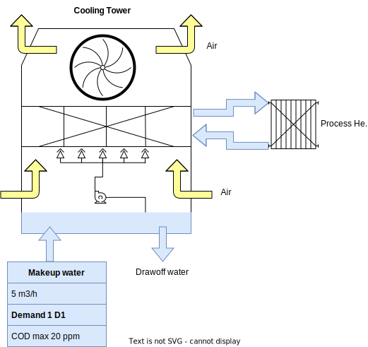

Dairy processing
================
We consider a hypothetical data representative of a dairy industry. The major challenge in terms of water-saving consists to reuse water from whey processing (microfiltration, reverse osmosis, and concentration). This water is considered a ``source`` (``S1`` and ``S2``) that can potentially be reused in other processes.
We consider also the makeup water supplied in the cooling tower. This water is considered a ``sink`` (or ``demand`` ``D1``) that can be supplied from the source streams.
Finally, we consider the use of water in CIPs for pre-washing (``post 1``) and rinsing (``post 2``) operations.
Inventory data is collected in the following table.

.. figure:: docs/source/WheyProcessing.drawio.svg
   
   bbbbbbbb

   

