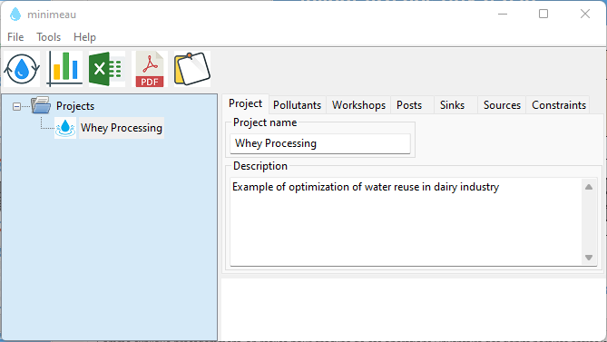
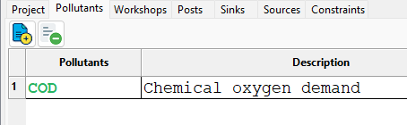

Dairy processing
================

Data Collection
*******************
We consider a hypothetical data representative of a dairy industry. The major challenge in terms of water-saving consists to reuse water from whey processing (microfiltration, reverse osmosis, and concentration). This water is considered a ``source`` (``S1`` and ``S2``) that can potentially be reused in other processes.

We consider also the makeup water supplied in the cooling tower. This water is considered a ``sink`` (or ``demand`` ``D1``) that can be supplied from the source streams.

Finally, we consider the use of water in CIPs for pre-washing (``post 1``) and rinsing (``post 2``) operations.

Inventory data is collected in the following table:

.. csv-table:: Data Collection
   :header: Workshop, "Inventory", "Type", water m^3/h, COD(in) ppm, COD(out) ppm, COD load kg/h

   Whey processing, RO permeate ``S1``, ``Source``, 10,--, 20,--
   Evaporation, Condensates ``S2``, ``Source``, 5,--, 60,--
   Cooling Tower, Makeup Water ``D1``, ``Sink``, 5, 20,-- ,--
   CIPs, Prewashing ``P1``, ``Post``,--,20,1000,100
   CIPs, Rinsing ``P2``, ``Post``,--,3,30,20
   

.. figure:: WheyProcessing.drawio.svg
   :target: _images/WheyProcessing.drawio.svg
   
   Whey Processing

   

   
   Cooling Tower

New project
******************
To add a new project, press ``Ctrl`` + ``N`` or click on ``New`` from ``File`` menu then enter the name of the project and add a description.

   
   Add a new project
   
 New pollutant
 **************
From the ``Pollutants`` tab, add the pollution indicator **DCO** (Chemical oxygen demand).

   
   Add a new pollutant
